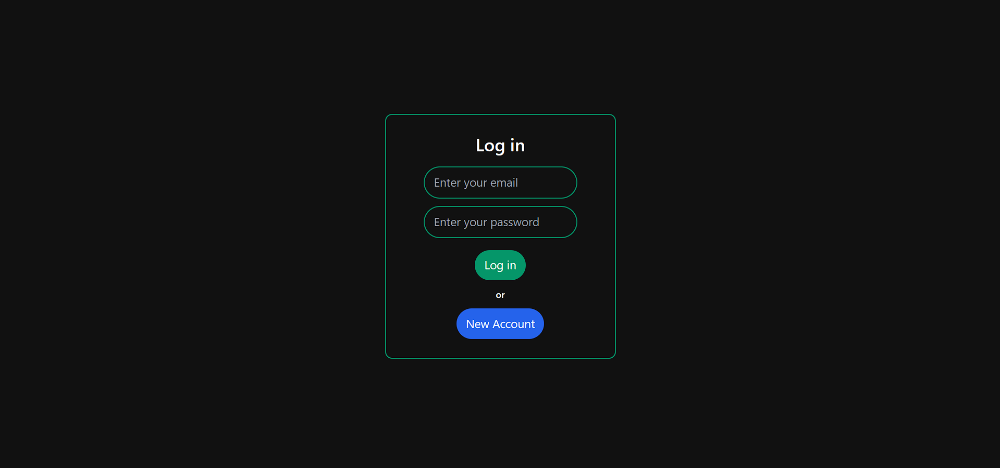
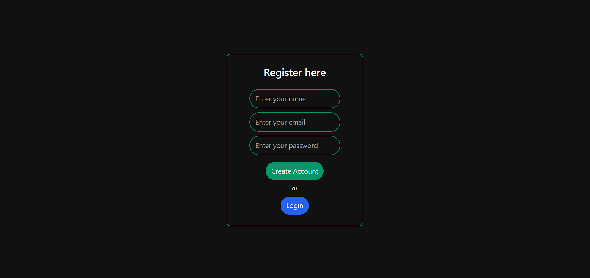
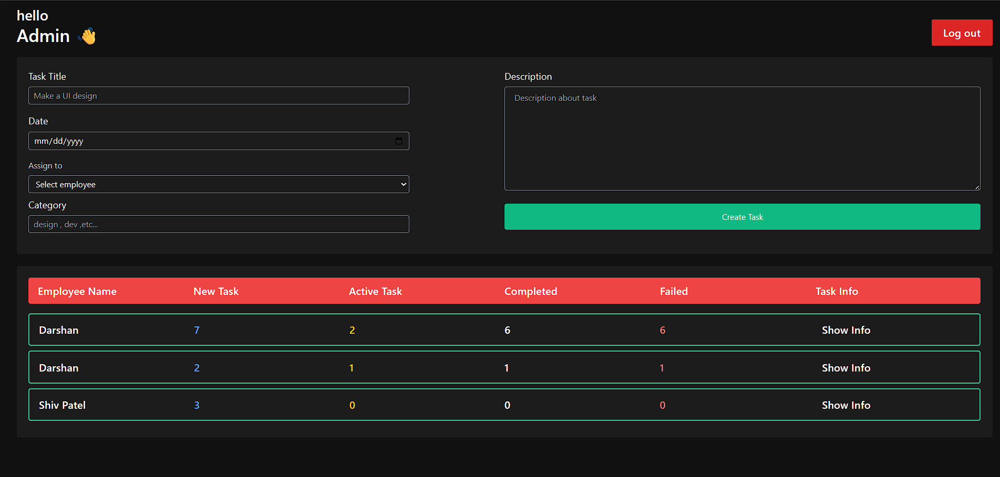
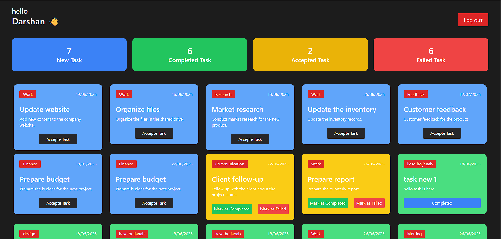

# 🧑‍💼 Employee Management System (EMS)

A full-stack web application for managing tasks within an organization. Admins can create and assign tasks to employees, and employees can track, accept, and update the status of their tasks.

🔗 **Live Demo:** [https://ems-orcin.vercel.app](https://ems-orcin.vercel.app)  
📁 **Repository:** [https://github.com/Dp20703/ems](https://github.com/Dp20703/ems)

---

## 🚀 Features

### 👨‍💼 Admin Dashboard

- View all employees
- Create and assign tasks
- Track task status (Accepted / Completed / Failed)

### 👨‍💻 Employee Dashboard

- View newly assigned tasks
- Accept tasks (moves to "Active Tasks")
- Mark tasks as **Completed ✅** or **Failed ❌**

---

## 🔐 Demo Admin Access

```
Email:    admin@ac.com
Password: 123456
```

> ⚠️ **Note:** Currently optimized for large screens (desktops/laptops). Mobile responsiveness is under development.

---

## 🛠️ Tech Stack

- **Frontend:** React.js, Tailwind CSS
- **Backend:** Node.js, Express.js
- **Database:** MongoDB (using MongoDB Atlas)
- **Deployment:** Vercel (Frontend), Render (Backend)

---

## 📦 Installation

### 1. Clone the Repository

```bash
git clone https://github.com/Dp20703/ems.git
cd ems
```

### 2. Setup Frontend

```bash
cd frontend
npm install
npm run dev
```

### 3. Setup Backend

```bash
cd backend
npm install
# Add a .env file (see below)
npm start
```

---

## 📁 Environment Variables (Backend)

Create a `.env` file in the `backend/` folder:

```env
PORT=5000
MONGO_URI=your_mongo_connection_string
JWT_SECRET=your_secret_key
```

---

## 🖼️ Screenshots

### 📝 Login



### 📝 Register



### 👨‍💼 Admin Dashboard



### 💼 Employee Dashboard



---

## 🧩 Folder Structure

```bash
ems/
├── backend/         # Node.js + Express server
├── frontend/        # React + Tailwind frontend
├── README.md
```

---

## 🤝 Contributing

Contributions, issues and feature requests are welcome!  
Feel free to open a pull request or raise an issue.

---

## 📃 License

This project is open-source and available under the [MIT License](LICENSE).

---

## 📬 Contact

**Developer:** Darshan Prajapati  
💼 [LinkedIn](https://www.linkedin.com/in/darshanprajapati)  
📧 Email: codewithdp2073@gmail.com
